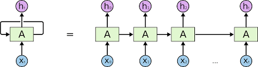
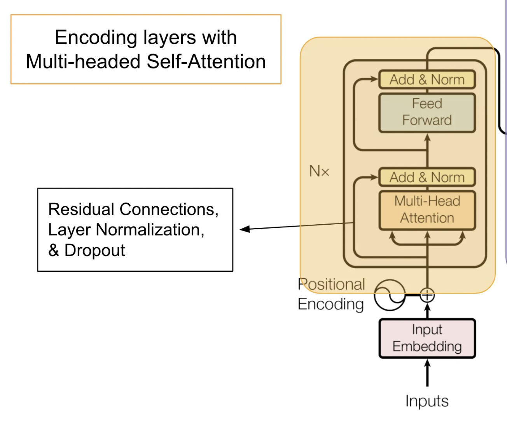

## Abstract

- Recurrent, convolutional network와는 다르게, Transformer Architecture (Vaswani et al, 2017) 모델에서는 입력으로써 위치 정보를 제공한다.
- 해당 논문에서는 self-attention 메커니즘에서 상대 위치 혹은 시퀀스 요소간 거리의 개념을 도입하여 self-attention을 확장하는 방법에 대해서 소개하려고 함.

## 1. Introduction

- 최근의 sequence to sequence learning 모델의 경우에는 Recurrence (Sutskever et al. 2014), Convolution, attention, 혹은 recurrence와 attention의 조합을 기본 골자로 하여 설계하는 방향으로 접근이 이뤄지고 있음.
    - 이러한 접근 방식은 각각의 sequential position에 대한 정보를 각각 함축하고 있음.
- RNN (Recurrent newral network) 의 경우에는 이전의 입력 $h_{t-1}$ 와  $h_{t}$ 의 합으로써 다음 블록에 전달할 **hidden state** 를 계산하는데, 이 과정에서 sequential element에 대한 위치 정보들을 캡쳐하게됨. (물론 각 블록은 이전 입력, 계산 중인 입력에 대한 국소적인 정보밖에 모른다는 단점도 존재)

</img>

- Non-recurrent model의 경우에는 sequential 입력에 대한 고려가 필요없기 때문에, sequence order 정보를 이용하기 위해서는 입력단에서 position encoding이 필연적으로 동반되는 특징을 지님.

> One common approach is to use position encodings which are combined with input elements to expose position information to the model. These position encodings can be a deterministic function of position (Sukhbaatar et al., 2015; Vaswani et al., 2017) or learned representations.

- 윗 인용의 의미는, Non-recurrent model의 경우에는 positonal encoding을 하는 것을 전제로 하는데, 이 때 Non-recurrent model의 입력으로써 제공되는 positional encoding은 deterninistic (삼각함수를 통한 접근, Attention is all you need, 2017) 혹은 가중치 기반 학습된 positional encoding일 수도 있음을 시사함.
    - Attention is all you need 논문의 경우에는 positional encoding을 아래의 수식으로써 풀이함.

$$
\text{PE}(pos, 2i) = \sin\left(\frac{pos}{10000^{\frac{2i}{d_{\text{model}}}}}\right)
$$

$$
\text{PE}(pos, 2i+1) = \cos\left(\frac{pos}{10000^{\frac{2i}{d_{\text{model}}}}}\right)
$$

> Convolutional neural networks inherently capture relative positions within the kernel size of each convolution.

- 합성곱 신경망의 경우에는 kernel(filter) size 이내에서는 상대적인 위치를 자연스럽게 학습한다는 특징을 가짐. (합성곱 신경망의 경우에는 kernal이 입력을 훑으면서 kernel 중심으로부터 상하좌우 위치를 학습하기 때문임)

> For the Transformer, which employs neither convolution nor recurrence, incorporating explicit representations of position information is an espe- cially important consideration since the model is otherwise entirely invariant to sequence ordering.

- Transformer 아키텍처 상에서는 convolution 혹은 recurrence를 전혀 하지 않기 때문에 sequential 하지 않아서 sequence order에 대해서 불변하다는 특징을 가지는데, 이러한 Transformer 아키텍처의 특징때문에 positional information을 명시적으로 표현해주는 것이 무엇보다 중요하다는 것을 시사하는 대목.

## 2. Background


#### 2.1 Transformer

- Transformer Architecture 에서는 encoder-decoder 구조를 채택하고있음.
- Encoder의 경우에는 아래의 구조를 가지는 Encoder Stack을 여러장 쌓아서 구성됨.

```
Encoder Layer = (Self-Attention) -> Add/Norm -> (Feed-forward) -> Add/Norm
```

</img>

- Decoder의 경우에는 아래의 구조를 가지는 Decoder Stack을 여러장 쌓아서 구성됨.

```
Decoder Layer = (self-Attention with mask) -> Add/Norm -> (Encoder-Decoder Attention with padding mask to encoder output) -> Add/Norm -> (Feed-Forward) -> Add/Norm
```

- 대신 Decoder 에서는 Self-Attention 과정에서 입력을 하삼각행렬로 만드는 마스킹을 적용하는데, 이는 학습 동안에 future output을 encoder input이 참조허지 못하도록 막기 위함임.

> In contrast to learned, absolute position representations, the authors hypothesized that sinusoidal position encodings would help the model to generalize to sequence lengths unseen during training by allowing it to learn to attend also by relative position.

- 저자들은 삼각함수를 이용한 positional embedding 방식이 학습으로 구성된 positonal embedding 방식에 비해서 sequence 길이를 일반화하는데 용이하다고 강조하였음.
    - 삼각함수의 경우에는 **R** 에서 연속인 매끈한 함수이기 때문에, 학습된 가중치의 경우에는 학습때 보지 못한 sequence 길이에 대해서는 대응하지 못하지만, 삼각함수 기반의 임베딩은 가능하다고 본것임.
    - 게다가 삼각함수를 통한 임베딩은 두 단어의 상대적인 거리를 유추하는데도 용이하다고 판단하였음.

#### 2.2 Self-Attention

TODO